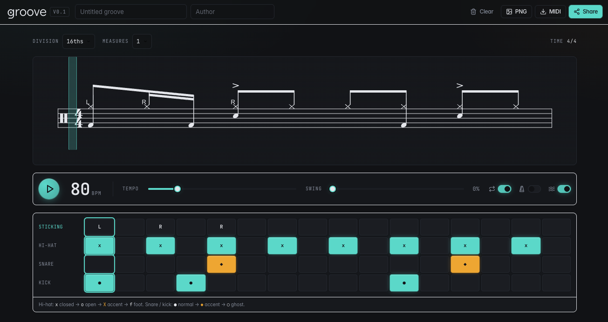

# groove

A drum groove editor and score renderer for the web. Click cells to build a beat, hear it through a synthesized kit, read it on a percussion staff, and share it as a URL short enough to paste anywhere. Frontend only. The whole groove lives in the link.



## Acknowledgments

This project would not exist without [GrooveScribe](https://github.com/montulli/GrooveScribe) and its creator, Lou Montulli. For years, even after the original project slowed down, I kept a personal fork running as my practice companion for drum studies. Without that tool I probably would not have progressed as far on the kit, nor gotten as comfortable with the underlying music theory.

It also sparked my curiosity about the stack behind music software on the web: how scores render, how audio is scheduled with tight timing, how state survives in a shareable URL. Following that thread is what pushed me to learn the tools this app is built on.

## Features

**Embed via iframe.** This is the feature I care about most. I use it on my personal wiki to document drum lessons and practice goals, and this app exists in large part so that workflow keeps working. Live example: [In the End (lesson notes)](https://wiki.guisso.dev/music/aulas-de-bateria-com-grillo/in-the-end/). The embed view has no editor chrome, can be locked read-only via `?ro=1`, and posts a `groove:resize` message to the parent so the host page can auto-fit the iframe height. The embed follows the host's OS theme automatically — no flicker, no JS listener, no postMessage protocol; it's a CSS `@media (prefers-color-scheme: dark)` rule. To force a specific look, pass `?theme=dark` or `?theme=light` in the URL. A small "Edit" link in the corner of the embed opens the same groove in the full editor in a new tab, so a reader who finds an interesting bar on a lesson page can jump straight into editing it.

> Heads up if you are embedding against a hosted instance on my domain (`guisso.dev` or subdomains): the URL payload format and route shape are not a stable API contract yet. I may change the codec or the routes as the project evolves, which will break embeds pinned to the old format. If you rely on embeds long term, fork this repo and host your own build instead.

**Notation that reads like a drum chart.** Beams group per beat, stems go up, notes at the same tick share a single stem, and empty space inside a beat is absorbed into the preceding note duration (a 16th followed by an empty slot becomes an 8th, and so on). A translucent marker follows playback through the score, sitting on the note currently ringing.

**Cell-based input grid.** Click to cycle note states: normal, accent, ghost, open hat, pedal. Lanes for hi-hat, ride, three toms (high, mid, floor), snare, and kick, with an optional sticking row for R, L, B. Visual gaps delimit beats inside each measure so the grid reads at a glance. The grid shows **one measure at a time** so 32nds × 8 bars stays readable instead of becoming a 256-column wall — the staff above is the full overview, the grid below is the focused editor.

**Multi-measure grooves.** A row of tabs `[ 1 ] [ 2 ] [ + ]` above the grid lets you add measures (up to 8) and switch which one you're editing. The staff is also clickable: tap any measure on the score and the grid jumps to it. When you press play, the grid switches to a vertical stack of every measure and auto-scrolls to keep the playing bar centered on screen — when you pause, it collapses back to single-measure view, parked on whichever bar was last playing so you can fix what you just heard.

**Synthesized audio via Tone.js.** No samples to download. Kick is a tight membrane synth, snare mixes filtered noise with a tonal body, hi-hats are shaped from white noise through carefully tuned filters, toms are pitched membranes, ride is filtered noise plus a tonal partial. Swing, loop, metronome, and count-in are all supported. When count-in is on it plays before every loop iteration, not just the first, so practicing against the chart feels like a real warm-up. A large on-screen counter shows the count-in beats.

**Short, shareable URLs.** State is packed into a compact binary format and base64url-encoded into the URL fragment. An empty groove is 11 characters. A typical 16-step rock beat fits in under 50. No server is involved at any point.

**MIDI input with live visual feedback.** Connect a MIDI drum device (the Aroma TDX 15S and similar e-kits work out of the box) and every hit drops a colored marker on the grid and on the staff in real time:

- **Green** on the actual notehead, when you hit the right pad on the right beat.
- **Amber** on the lane you played, when the timing was right but the pad was wrong.
- **Red** on the lane you played, when nothing was expected at that step.

A tolerance slider gives a small grace window so a hit slightly off the grid still counts. While playback is stopped, hitting a pad lights up its first grid cell so you can verify the device-to-voice mapping before practicing.

**Settings drawer.** A side panel (open via the Settings button) holds the gear: MIDI device connect/disconnect, latency offset and tolerance sliders, last-pad readout, the practice-mode toggle, and the MIDI/PNG export buttons. An **Editor** section there also lets you collapse the tom rows or the cymbal rows (today just ride, more cymbals coming) when you're working on a hat-snare-kick groove and the extra lanes are noise. The toggles are purely visual — the staff and audio always reflect every note in the groove, and the choice is per-browser, never part of the shareable URL.

**Practice review mode.** Optional silent pause between loops (1–30 s, default 10) gives you a moment to study your hits before the next bar comes around. Markers stay on the staff and the grid for the whole review window; they clear at count-in 3 of the next loop. Pressing pause keeps the markers — only the next Play clears them.

**Practice timer.** A toggle next to the Loop switch turns the loop into a bounded practice session: type the duration in minutes, hit play, and a small `MM:SS` clock floats over the bottom of the staff while the groove cycles. When the countdown hits zero the transport stops automatically. The clock is an overlay, not in the document flow, so enabling it never changes the page height — embeds with a fixed iframe height stay exactly the same size. The timer is intentionally available in read-only embeds (`?ro=1`) too, so a shared chart on a lesson page can be used as a self-contained practice loop. It requires loop on; turning loop off auto-disables the timer.

**MIDI and PNG export.** Download the groove as a standard `.mid` file (GM drum mapping) or as a PNG of the rendered score. Both buttons live inside the Settings drawer.

**Light and dark themes.** Tuned to match the aesthetics of modern audio software. The editor defaults to dark; embeds default to following the host's OS theme via CSS, with `?theme=dark` / `?theme=light` as explicit overrides.

**Keyboard shortcut.** Press <kbd>Space</kbd> to play/pause. (The grid and inputs swallow the key when focused, so typing in a title field stays normal.)

## Stack

Vue 3, TypeScript, Vite, Pinia, shadcn-vue, VexFlow, Tone.js, `@tonejs/midi`, Tailwind CSS.

## Running locally

```sh
npm install
npm run dev
```

Open `http://localhost:5173`.

Production build:

```sh
npm run build
npm run preview
```

## URL shape

- Editor: `/#/g/<payload>`
- Embed: `/#/embed/g/<payload>` (append `?ro=1` to lock the transport)

The payload is a bit-packed binary representation of the groove, base64url-encoded. An empty groove is 11 characters. Typical patterns sit around 30 to 50.

## Roadmap

Things I want to get to, roughly in the order I think about them. No promises on timing.

Near term

- [ ] Undo and redo.
- [ ] Triplet feel: make divisions 6, 12, 24 render as tuplets on the score instead of falling back to straight eighths.
- [ ] More time signatures: 3/4, 2/4, 6/8 (beaming rules for compound meters).
- [ ] Print friendly layout and PDF export.
- [ ] Mobile touch polish (bigger hit targets, horizontal scroll affordance).

Medium term

- [ ] Grooves library: a small browsable set of named presets (rock, funk, shuffle, common fills), similar to the old GrooveScribe menu.
- [ ] Per-measure variation inside a multi-bar groove (intro, verse, fill).
- [ ] Click-and-drag to paint cells across a row.
- [ ] More keyboard shortcuts on top of the existing <kbd>Space</kbd> for play/pause.

Long term

- [ ] Refine the MIDI tutor: missed-note markers (red dot on the expected notehead when nothing landed in the tolerance window), and an audio-clock-anchored timeline so timing offsets can drive sub-step horizontal placement on the staff. See `docs/progress.md` for the cautionary tale on the first attempt at this.
- [ ] Built-in lesson flow on top of the live MIDI feedback: streak counter, per-bar accuracy summary, exit criteria.
- [ ] Exercise templates with progressive tempo (start at 60 bpm, bump 2 bpm per successful loop).
- [ ] Self-hosted sync of saved grooves across devices (optional, still no account by default).

Maintenance

- [ ] More codec test coverage (property-based round-trip fuzz).
- [ ] Accessibility pass (keyboard nav of the cell grid, ARIA for the transport).

## Privacy and analytics

> **Heads up — there's an analytics tracker in `index.html`.** It is gated by a hostname check and only loads when the page is served from `guisso.dev`. Local dev, forks, and any other self-hosted build skip it entirely.

The tracker is [Tianji](https://github.com/msgbyte/tianji), a privacy-friendly self-hosted analytics tool I run at `tc.guisso.dev`. I use it to know whether the public hosted instance is being used; no personal data is collected.

The relevant block in `index.html`:

```html
<script>
  if (location.hostname === 'guisso.dev') {
    /* injects https://tc.guisso.dev/tracker.js with data-auto-track="false"
       and emits one manual pageview on load. */
  }
</script>
```

Auto-tracking is disabled on purpose — Tianji's default behaviour wraps `history.pushState` / `history.replaceState`, and the editor rewrites the URL hash on every cell edit. With auto-tracking on, every keystroke would fire a pageview. Instead we record exactly one event per page load.

If you would rather not have it in your tree at all, delete the block from `index.html` or revert the commit that introduced it (look for `chore: add Tianji analytics` in the log). Either is harmless — nothing else in the app depends on it.

## About this project

Groove is coming together piece by piece. My main goal is to learn more about music software (how scores render, how audio is scheduled, how state survives in a URL) and to build a tool I can actually use in my own drum practice. I pull features from GrooveScribe where it makes sense and add new ones as I see the need.

The longer arc is to document my drum studies thoroughly and, further down the road, bridge into an open-source digital tutor that can talk to my electric kit. That is a long road and I am walking it slowly.

## Contributing

Code, bug reports, and feedback are all welcome.

A note before you open a PR: I do not have a strong formal music background, and I expect other contributors here to often be curious programmers in the same boat. If you are proposing a feature rooted in music theory or drum notation conventions, please explain the concept in your PR description. Write as if the reader is a capable programmer but not a music teacher, and teach us what you are adding. The same for programmers, explain to musician what you are doing.

Let us treat this build as an excuse to learn together.
